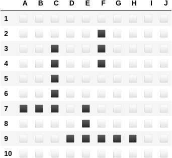
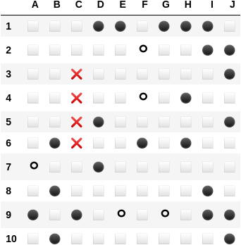
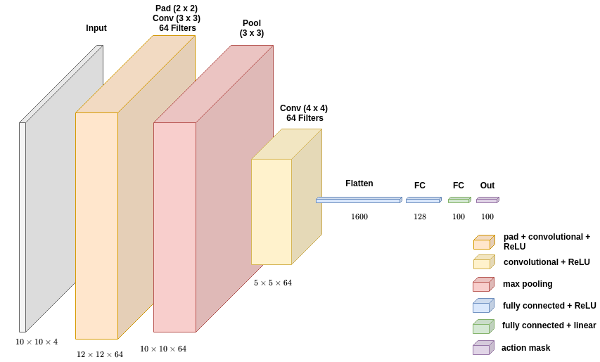

# Introduction
The following is a university project of a DQN agent playing the attacker in the game battleship. It plays on a 10x10 grid using a CNN to approximate the value function. A full description and analysis can be seen in the [report](Using_DQN_Agents_to_play_Battleship.pdf).

<div style="text-align: center;">
  <div style="display: inline-block;">
    <div style="display: flex; justify-content: center; align-items: center;">
      
      
    </div>
    <p>Left side: battleship positions, Right side: observation given to agent</p>
  </div>
</div>

<div style="text-align: center;">
  <div style="display: inline-block;">
    <div style="display: flex; justify-content: center; align-items: center;">
      
    </div>
    <p>Q-value estimation network used</p>
  </div>
</div>

# Installation
1. Install Python `3.9`
2. `pip install -r requirements.txt` - installs basic python dependencies
3. `pip install git+https://github.com/NiklasZ/gym-battleship` - installs battleship environment

# Implementation
This implementation makes heavy usage of `tensorflow` and `tf-agents`. The main files of interest are:
* `agents/train_agent.py` - trains a DQN agent.
* `agents/tune_agent.py` - randomly tunes many DQN agents.
* `training/tf_dqn_agent.py` - contains tuning specifications.
* `models/cnn.py` - generates a CNN architecture according to configuration.
* `training/best_agent_tester.ipynb` - training of specific CNN configurations.

# Data & Models
All training-related data is in `training/data/1_tuning`. For example, in 
`training/data/1_tuning/2022-03-14T14-30-38-10x10-promising-cnns` we have:
* `logs` where each folder inside contains training metrics. Viewable via:
`tensorboard --logdir training/data/1_tuning/2022-03-14T14-30-38-10x10-promising-cnns`
* `top_parameters.json` - not an actual JSON but a dump of hyper-parameter dictionaries that can be used 
to re-run a particular model configuration.
* `policies` contains agent policies of the best models. They can be loaded and tested via:
```python
saved_policy = tf.compat.v2.saved_model.load(f"training/data/1_tuning/2022-03-14T14-30-38-10x10-promising-cnns/1")
policy_state = saved_policy.get_initial_state(batch_size=1)

time_step = eval_env.reset()
counter = 0
while not time_step.is_last():
    action_step = saved_policy.action(time_step)
    time_step = eval_env.step(action_step.action)
    eval_py_env.render()
    counter +=1

eval_py_env.render_board_generated()
print(f'Completed in {counter} steps')
```
